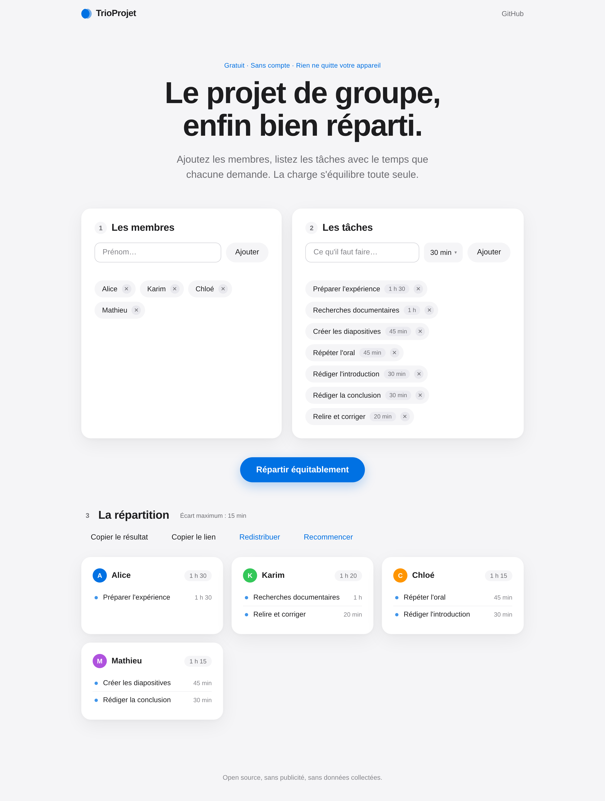

# TrioProjet

**Le projet de groupe, enfin bien réparti.**

TrioProjet est un outil pour les étudiants : vous ajoutez les membres du
groupe, vous listez les tâches avec le temps que chacune demande, et l'outil
équilibre la charge réelle — pas seulement le nombre de tâches. Plus de
dispute sur qui fait quoi, et surtout plus de personne qui se retrouve avec
tout le travail.

## Pourquoi ?

Parce que les projets de groupe, c'est souvent le même scénario : deux
personnes travaillent, une personne disparaît, et la répartition se fait dans
la précipitation la veille de l'échéance. Et compter les tâches ne suffit pas :
préparer une expérience (1 h 30) et relire le plan (20 min) ne pèsent pas le
même poids. TrioProjet répartit la charge en temps, en 30 secondes, avec une
méthode que tout le monde peut vérifier.

## Utilisation

Le site est disponible en ligne : **https://strongbug999.github.io/trioprojet/**

1. Ajoutez les membres du groupe (au moins deux)
2. Listez les tâches et estimez leur durée — 30 min par défaut, modifiable
   d'un clic sur chaque tâche
3. Cliquez sur « Répartir équitablement »
4. Copiez le résultat pour le groupe, ou copiez le lien du projet :
   il transporte les membres, les tâches **et** la répartition, prêts
   à s'afficher chez ceux qui l'ouvrent

Aucune inscription, aucune publicité, et **toutes les données restent sur
votre appareil** : aucune requête externe, aucun serveur, aucun suivi.

## Comment l'équilibrage fonctionne

Les tâches sont mélangées, classées de la plus longue à la plus courte, puis
chacune rejoint, tiré au sort, l'un des membres qui ont le moins de temps sur
les épaules. C'est l'heuristique *Longest Processing Time* avec égalités
décidées au hasard : simple à expliquer en une phrase, très difficile à
battre à la main, et jamais prévisible — la plus grosse tâche ne revient pas
systématiquement à la même personne. L'écart de charge entre membres est
affiché sous le résultat — il ne dépasse jamais la durée de la plus petite
tâche.

## Fonctionnalités

- Répartition **par charge réelle** (durées estimées, pas par simple compte)
- Tirage au sort des égalités : le résultat n'est pas mécanique — et le
  bouton « Redistribuer » relance la loterie si le hasard déplaît
- Durées modifiables d'un clic (10 min à 10 h, valeur libre possible)
- **Lien de partage** : membres, tâches et répartition tiennent entièrement
  dans l'URL, sans serveur
- Résultat copiable prêt à coller dans le groupe
- Sauvegarde automatique sur l'appareil (localStorage)
- Zéro dépendance, zéro requête externe, fonctionne hors connexion

## Technologies

Du HTML, du CSS et du JavaScript. C'est tout.

- **0 dépendance**, aucun framework, aucune base de données
- **0 serveur** : le site est un ensemble de fichiers statiques
- **0 requête externe** : pas de police téléchargée, pas d'analyseur, rien
- Les données sont conservées dans le `localStorage` de votre navigateur

## Feuille de route

Des idées pour les prochaines versions (toute contribution est bienvenue) :

- [ ] Indiquer ses préférences (tâche souhaitée / tâche évitée) pour une
      répartition qui tient compte des envies
- [ ] Export du résultat en image pour partage facile
- [ ] Version anglaise
- [ ] Mode sombre

## Contribuer

Les contributions sont les bienvenues, même (surtout !) si c'est votre première
fois. Consultez [CONTRIBUTING.md](CONTRIBUTING.md) pour bien démarrer.

## Licence

[MIT](LICENSE) — faites-en ce que vous voulez.
